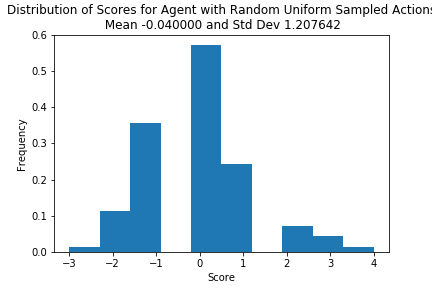
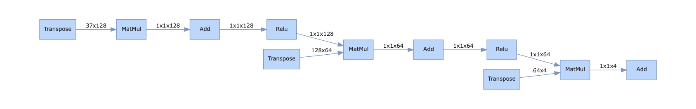
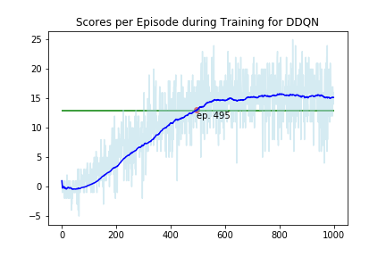
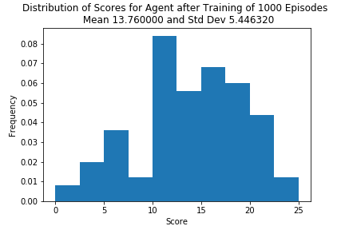

# Report 

## Structure of the used network

## Baseline Evaluation
To evaluate the performance of the agents we performed a baseline test at the beginning of the project and run the environment N=100 times with random uniformly distributed actions. Below diagram shows the distribution with its mean and standard deviation from this experiment. Assuming that yellow bananas with reward +1 and blue bananas with reward -1 are evenly distributed in the environment it is reasonable that average score for such an agent is approximately 0.

## Learning Algorithm
We utilized an agent with a fully connected neural network with two hidden layers of size 128 and 64, respectively. All intermediate layers are followed by a relu-function. The full network in detail is vizualized below with the help of the hiddenlayer package:

### Hyperparameters
The following hyperparameters were used throughout.

| Hyperparameter     | Value  |
|--------------------|--------|
| eps start value    | 1.0    |
| eps end value      | 0.01   |
| eps decay rate     | 0.995  |
| Replay buffer size | 100000 |
| Gamma              | 0.99   |
| Learning rate      | 0.0005 |
| Tau                | 0.001  |
| Network update rate| 4      |

## Results

### DDQN

The learning with DDQN achieved the goal of more than 13 points in average per 100 episodes after 495 training episodes and stabilized with an average score of approx. 15.5.

Evaluation of the trained agent against N=100 episodes yields an average of 13.76 with a standard deviation of 5.4. The distribution of this experiment is shown below. 

## Ideas on Future Work and Possible Improvements

- The current implementation is far from optimal and it is very likely to improve by more hypertuning parameter or variation of the underlying network both performance of the agent and the speed of learning. I plan to pick this up at a later point in time.
- Given that a real world implementation of a navigation robot is a reasonable application (if not looking for bananas, it might vacuum the floor or collect socks) it would also be interesting to search for the network of least complexity achieving the task since the evaluation would run on an embedded hardware of limited computing power.